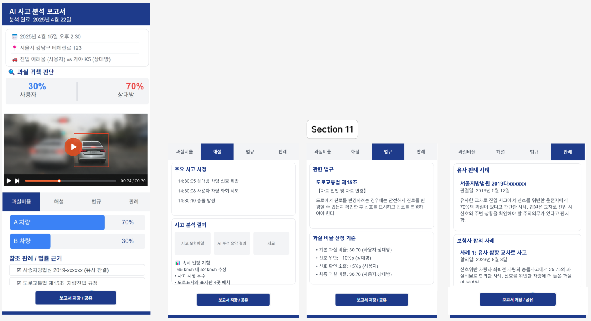
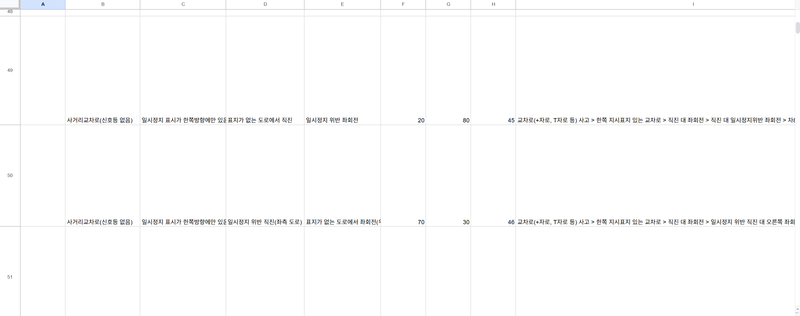
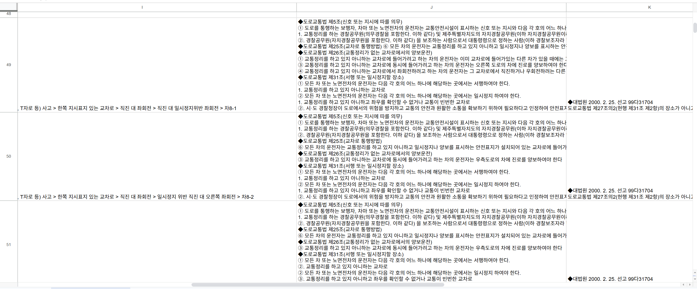
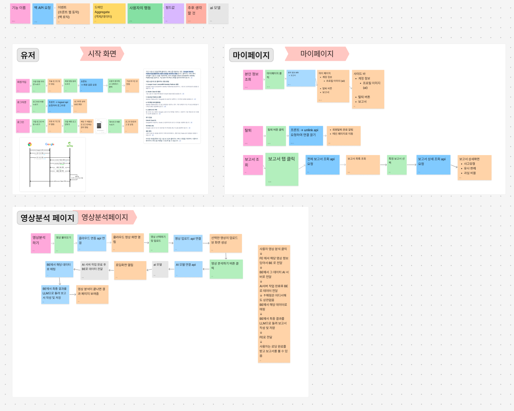
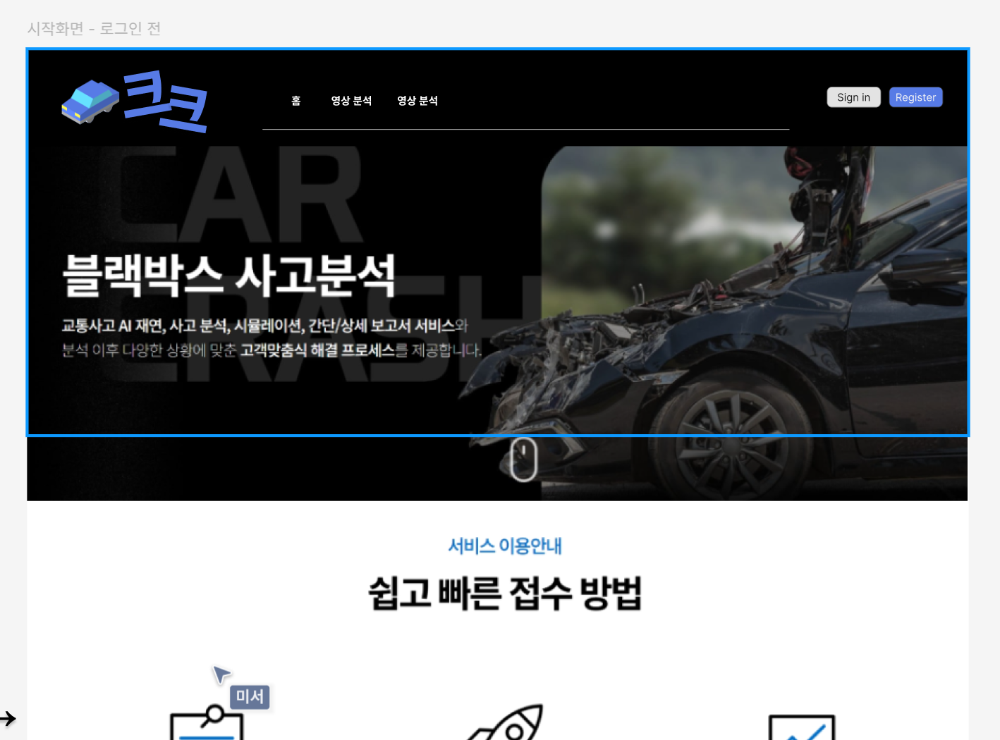
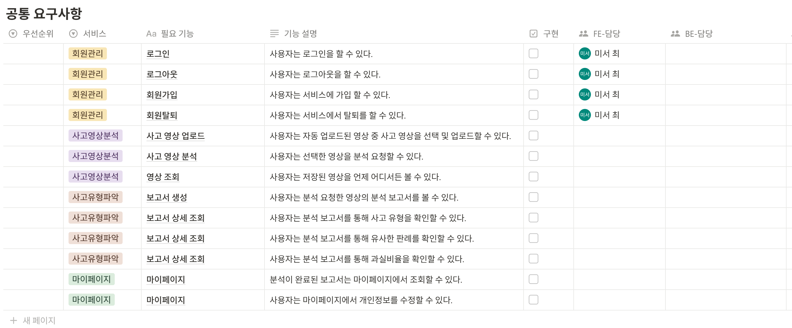

# 250428
데이터 전처리
- 직선도로 140208부터
- T자형교차로 200122 까지하기
- Training 161105까지 함. 161030부터~

# 2025-04-24
1. 판례 작성 완료
2. 결과물 보고서 피그마 수정


+ json 데이터에서의 추돌 위치 작성할 것

# 2025-04-23
사고 유형과 판례 매핑



# 2025-04-22
1. 기획 상세하게 잡기
```
# 250422 첫번째 회의 - 결과 보고서 프레임 작성/업로드 방식 고민

1. 영상 업로드 방식 
- 기존 → 구글 클라우드 or OneDrive랑 연동되는 것으로 생각
- 수정
    - 시중에 나온 블랙박스를 사용할 경우 → 영상 다운로드 후 갤러리 접근을 통한 분석 앱에 업로드 → 분석
+ 블랙박스를 직접 만들어서 구글 클라우드 연동을 통해 자동 업로드 되는 것을 보여줄 것인가

궁금한 점
- 생각해 본 결과물의 형태가 영상 다운로드 후 앱에 업로드하는 과정을 감수할 만큼의 가치가 있는지
- 시중에 나온 블랙박스 영상에는 접근할 수 있는 방법이 없습니다. 기존에는 활용성에 초점을 두고 기획했는데, 블랙박스를 만들게 되면 특정 경우에만 사용이 가능한 서비스가 되어서 활용성이 낮아집니다.

결과
1. 블랙박스 앱에서 로컬에 저장 - 로컬에서 블랙박스 분석 업로드  
2. c to c 케이블로 블랙박스 - 핸드폰 연결해서 파일 전송
3. 블랙박스를 만들기 - 특정 블랙박스에서만 클라우드 자동 연동되는 것
```

2. 컨설턴트 님과 면담
```
- 결과 - 보고서 내용 들어가자마자 영상이 보이도록 + 시간 순대로 결과 분석 나오도록.
- 블랙박스 앱에서 로컬에 저장 - 특정 폴더에 영상이 내려받아짐
- 백그라운드에서 앱이 자동으로 실행되고 폴더에 대한 접근 허용한 상태
- 사용자가 블랙박스 앱에서 영상을 내려받으면 백그라운드에서 자동 실행되던 앱이 - - 영상을 분석한 후 알림을 통해 분석 완료 내보내기
- 고민했던 내용 + 회의 결과 + 피그마 내용 싹 다 취합해서 미리 한문철/변호사에게 보내놓기  
- 실제 블랙박스를 사서 시연까지 연결해서 보여주기 (2번 내용 이어서)
- 아이나비 + 파인뷰 - 점유율 70% 이상. 나머지 버리기

+ 온디바이스 → 경량화된 AI를 통해 프론트엔드에서 영상 첫 이미지를 분석해서 도로상황이 아니다 → 사고 영상이 아님. 도로상황이다 → 분석 시작 
```

3. 면담 후 기획 마무리
```
- 1번 방법을 통해서 로컬 저장 후 업로드 하는 방식 채택
    - 완전 앱으로 가게 될 경우 기존 앱을 다뤄본 사람이 없음
    - 앱으로? - 일단 고민해봐야함.
- 모델 교체함 - 정확도가 너무 낮음 11%
    - 학습 시간 필요
    - 전처리 x → 이미 라벨링되어있는 데이터. 물리적인 인원은 없어도됨. 학습시간만 필요하기 때문
    - AI 인원 조정 필요 - 아..Jira 바꿔야함......................
- 비어있는 영상 데이터 채워야함 - 법률 부문.
    - json 데이터만 보고는 알 수 없으니 영상을 보고 넣어야하는 부분.
    - accident_negligence_rateA, B → 과실 비율
raws → 비어 있음. 이 부분 채우기 + 과실 비율 맞는지 검증
- 차대차, 차대보행자 ... 법률 부문 학습량이 너무 방대함
    - 특정 사고유형만 학습하는 방법으로?
- 일단 신빈/희원 - 법률 공부 후 필요한 자료 찾아서 공유
- 미서 - 프론트엔드 앱 어떤 식으로 할 지 공부해온 후 추가 인원 필요하면 역할 재분배.

# AI 결론
1. 교통사고 판단할 만한 특징 (64가지에 대한 판례로 가정)
    - 도로 상황(현재위치) - 8가지 →  직선도로/사거리교차로/신호등유무도로/T자형도로/주차장~
    - 경찰청 데이터 뽑아오기 - 발표 근거 자료
    - accident_place_feature - 박는 위치 1~8
1 2 3
4   5 
6 7 8
+ (과속 유무)

=> ex. 직선도로에서 어떤 부분에 박아서 어떤 과실이 나왔는지 ~

2. 지표에 따른 결과 ex. 주변상황+어디에 박았는지 → 과실비율이 어떻게 나오는지       - 판례 기준 자료 찾기
    - 표로 정리
    - 데이터와 매핑


- 배포
play store/app store 신청해서 누구나 다운받을 수 있도록
시간이 걸리기 때문에 간지를 위한다면 미리 신청할 것
.exe 파일로 허용된 사람들만 내려받도록 하기
```


# 2025-04-21
1. Ubuntu에서 환경설정
```
cd /mnt/c/Users/SSAFY/Downloads
ls
mkdir -p ~/aihubshell
cp aihubshell ~/aihubshell/
cd ~/aihubshell
chmod +x aihubshell
./aihubshell -mode d -datasetkey 597 -filekey 509296 -aihubapikey 'API Key 작성'
./aihubshell -mode d -datasetkey 597 -filekey 509296 -aihubapikey 'API Key 작성'

cd /aihubshell/095.교통사고_영상_데이터/01.데이터/1.Training/라벨링데이터_231108_add
unzip TL_차대보행자_이미지_육교및지하도부근.zip
cd /aihubshell/095.교통사고_영상_데이터/01.데이터/1.Training/원천데이터_231108_add
unzip TS_차대보행자_이미지_육교및지하도부근.zip
```
2. 가상환경 설치
```
sudo apt install update
sudo apt install upgrade
sudo apt install python3-pip
sudo apt install python3.12-venv
python3 -m venv venv
source venv/bin/activate
pip install tqdm
```
3. 라이브러리 설치
```
# PyTorch 설치 (CUDA 없으면 CPU용)
pip install torch torchvision torchaudio --index-url https://download.pytorch.org/whl/cpu

# MMDetection 설치
pip install openmim
pip install --upgrade pip setuptools wheel
mim install mmengine
mim install 'mmcv>=2.0.0'
git clone https://github.com/open-mmlab/mmdetection.git
cd mmdetection
pip install -e .
```


# 2025-04-17
## 유저플로우 피그마

## 홈화면 피그마


# 2025-04-16
## 기획 초안

- 주제:  **AI 기반 블랙박스 영상 교통사고 과실 판단 시스템**
- 개요:
    - 사용자가 **블랙박스 영상을 업로드**하면, **AI 기반 사고 유형 파악 및 법률 정보 분석**을 통해 교통사고 상황을 자동 분석하고, 대한민국 교통사고 처리 기준에 따른 **과실 비율을 산정 및 설명해주는 웹 서비스**
    - 유사 사례 비교 기능, 과실 비율 제공 및 변호사 상담 신청 기능까지 포함하여, 운전자에게 실질적인 도움을 줄 수 있는 종합 사고 분석 플랫폼을 목표
- 주요 기능:
    1. 블랙박스 영상 분석
        - 객체 인식(차량, 보행자, 신호등, 차선 등) + 사고 유형 분류 모델
        - 속도, 진행 방향 등 추정 → 사고 유형 및 책임 분석
    2. 과실 비율 자동 산정
        - AI(RT-DETR / VTN 멀티 모달)로 사고 유형 파악
        - LLM + RAG 기반 법률 지식 기반 사고 책임 분석
        - 법적 근거(판례) 기반 과실근거 제시
    3. 과실 비율 산정 후 법적 도움을 받을 수 있는 연결고리 제공
        - 실시간 채팅 or 화상 채팅 (둘 중에 하나만 구현)
        - 정확한 상담을 위한 추가 정보(차량, 사고 위치 등) 입력 요구
- 추가 기능:
    1. 사례 비교 및 커뮤니티 기능
        - 비슷한 사고와 과실 비율 비교
        - 사용자 간 의견 교환 및 질문 가능
    2. 사고 유형 태깅 및 분류
        - 사고 유형 태깅을 통한 유사 사고 쉽게 탐색
        - 필터링 및 검색 기능
- 차별성:
    - AI 기반 사고 분석 →  사람이 주관적으로 판단하는 것이 아닌, **AI가 영상 분석 및 법률 근거 제시**
    - 실시간 분석을 통한 사용자의 결과 확인 시간 감소 및 편의성 극대화(기존 서비스는 1~10일 소요)
    - **RT-DETR** 사용으로 빠른 객체 검출
    - 맞춤 변호사 연결을 통해 사용자가 추가적으로 정보를 알아볼 필요 없음
    - YOLO 기반 모델보다 복잡한 관계성(예: 신호위반 + 충돌) 해석 가능
    - 부산시 무료 상담
    https://www.busan.go.kr/depart/freelegaladvice



# 2025-04-15
## 한문철 블랙박스
블랙박스 영상 기반 교통사고 과실 판단 시스템

1. 프로젝트 개요

차량 블랙박스 영상을 업로드하면 AI 기술을 활용하여 교통사고 상황을 분석하고 과실 비율을 자동으로 측정해주는 웹 서비스입니다. 객체 인식 기술로 도로 상황을 파악하고, 법률 정보를 기반으로 과실 비율을 산정합니다.

2. 주요 서비스 기능

- **블랙박스 영상 분석**: 사용자가 업로드한 영상을 AI 기술로 분석하여 과실 비율 자동 산정
- **커뮤니티 게시판**: 분석된 블랙박스 영상을 공유하고 다른 사용자들과 의견 교환 가능
- **사고 유형 태깅**: 영상에 ‘추돌사고’, ‘측면충돌’, ‘신호위반’ 등 태그를 부여하여 분류
- **실시간 알림**: 분석 완료 시 SSE(Server-Sent Events) 기술을 활용한 실시간 알림 제공
- **이메일 알림**: 장시간 소요되는 분석의 경우 이메일로 완료 알림 발송
- **과실 근거 제시**: LLM과 RAG 기술로 대한민국 교통사고 처리 기준에 따른 과실 산정 근거 제공
- **유사 사례 조회**: 태그 기반으로 유사한 사고 사례와 과실 판단 결과 비교 가능
- **법률 정보 제공**: 사고 유형별 관련 법규 및 판례 정보 제공

# 2025-04-14
## 드론을 활용한 긴급 재난 구호 물품 전달 및 구조
1. 개요
- Tello EDU 드론을 기반으로 하여 화재가 난 건물 내부에서 사람을 인식해 그 정보와 위치를 실시간으로 소방관에게 전달, 사용자(소방관)로부터 입력된 지정 위치까지 구호 물품을 운반하여 안전하게 드롭하는 시스템

2. 사용 물품
- Tello EDU 드론
- 라즈베리 파이
- 열화상 카메라

3. 주요 기능
- 자율 비행 제어
    - Pixhawk를 활용하여 사전 정의된 경로 및 미션 플랜에 따라 드론을 자동으로 제어
- 현장 인식 및 실시간 모니터링
    - 열화상 카메라와 라즈베리 파이를 이용하여 화재 건물 내부에서 사람을 검출
    - 실시간 영상과 인식 데이터를 지상 통제센터 또는 소방관에게 전송
- 구호 물품 전달
    - 사용자가 입력한 목적지 좌표에 따라 자율 주행을 통해 구호 물품(경량 패키지)을 운반
    - 지정 위치에 안전하게 드롭

4. 하드웨어 구성
- 드론
    - Tello EDU 드론 (SSAFY 교보재)
    - 픽스호크 PX4 오토파일럿 2.4.8 32bit ARM 비행 컨트롤러 을 통한 UART/I2C 통신
- 라즈베리 파이 + 모듈
    - 영상 처리 및 객체 인식 수행
    - 열화상 카메라를 활용해 화재 현장의 인체를 감지
    - 실시간 영상 스트리밍 기능 제공
    - 통신 모듈을 통한 지상 통제 센터와 실시간 데이터 전송
- 구호 물품 전달 장치
    - 지정 위치에서 물건이 드롭될 수 있도록 장치 추가 설계 필요 

5. 소프트웨어 구성
- 자율 비행 및 미션 제어 (Pixhawk)
    - PX4 or Ardupilot과 같은 오픈 소스 펌웨어 활용을 통한 이착륙, waypoint 기반 경로 실행 등
    - 통신 프로토콜(QGroundControl)
- 객체 인식 및 실시간 스트리밍
    - WebRTC 기반 프로토콜을 이용하여 지상 통제센터로 실시간 데이터 전송
    - OpenCV와 Tensorflow Lite를 활용한 실시간 detection
    - 인식된 객체의 위치를 Pixhawk의 GPS/IMU 데이터와 연계해 건물 내 상대적 또는 절대적 좌표 산출
- 구호물품 전달
    - QGroundControl을 통해 목적지 좌표를 입력하면 자동으로 경로를 생성하여 Pixhawk에 전달
    - 경로 내 장애물이나 비상 상황을 고려한 비상 복귀(RTL) 루틴 포함
    - 도착시 정밀 착륙 혹은 낮은 고도에서 서보 신호를 통해 구호물품을 투하
    - 센서(기울기 센서, 고도 센서 등)를 통해 드롭 상태를 확인하고, 드롭 성공 여부를 실시간 보고고

6. 고려 사항
- 하드웨어 통합
    - Tello EDU는 교육용에 최적화 -> Pixhawk 및 추가 센서 및 컴퓨팅 모듈(라즈베리파이)의 물리적 통합에 대한 모듈 설계와 무게 분산 필요(날 수 있을지)
    - 드론 하중 제한 고려
- 통신 안정성
- 비상 대응
    - 배터리 부족
    - 통신 단절
    - 자동 복귀 및 긴급 착륙 기능 구현 필요
    - 화재 현장에서의 고온, 연기 등으로 인한 카메라 성능 저하 문제 대책 마련
- 화재 상황에서의 인체 인식 정확도를 높이기 위한 딥러닝 모델 훈련 및 환경 적응(열영상, 저조도 영상 처리) 고려 필요 