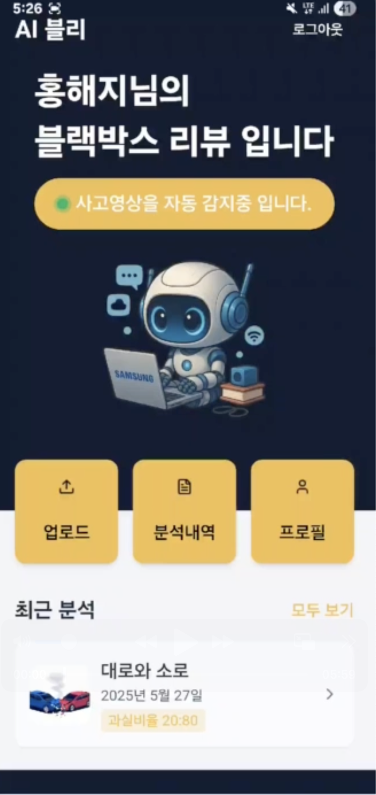
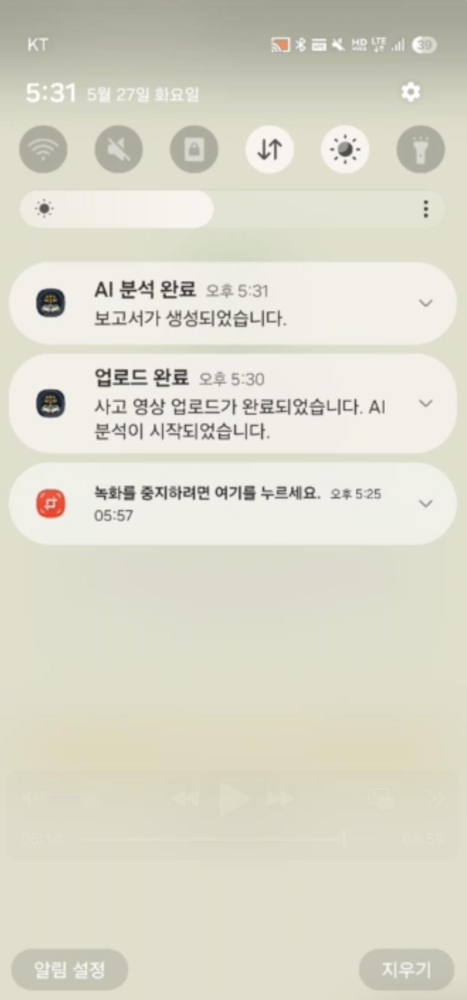
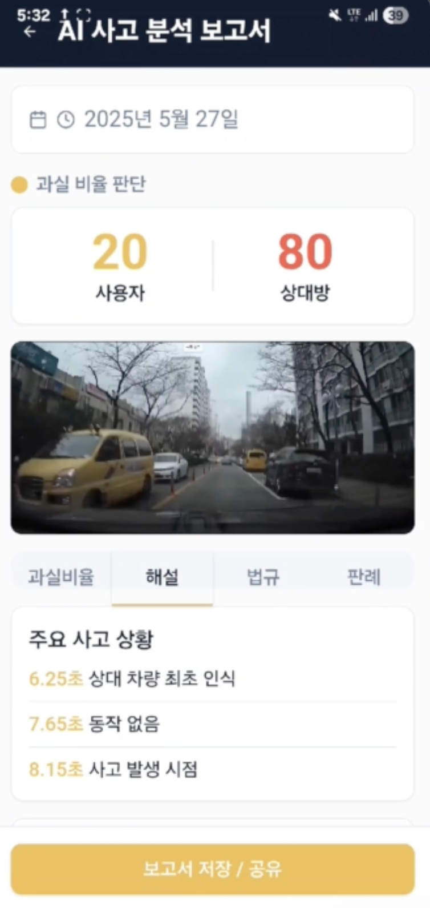
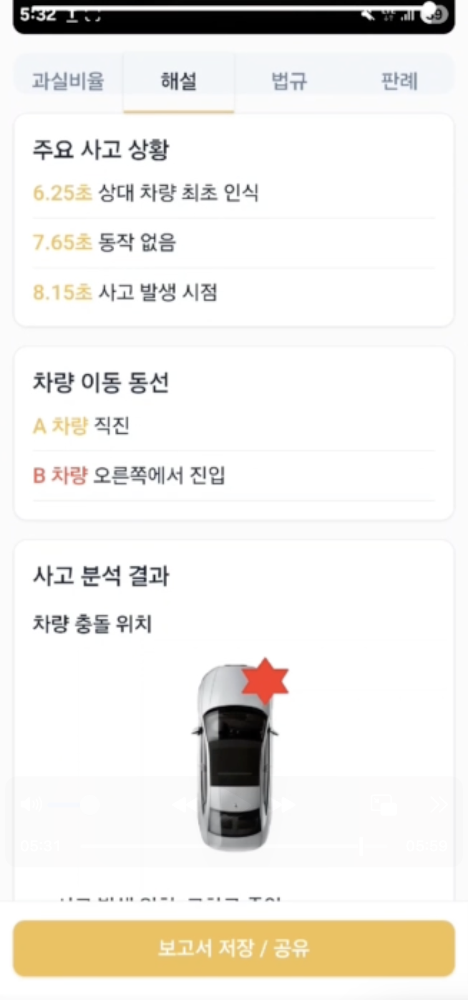
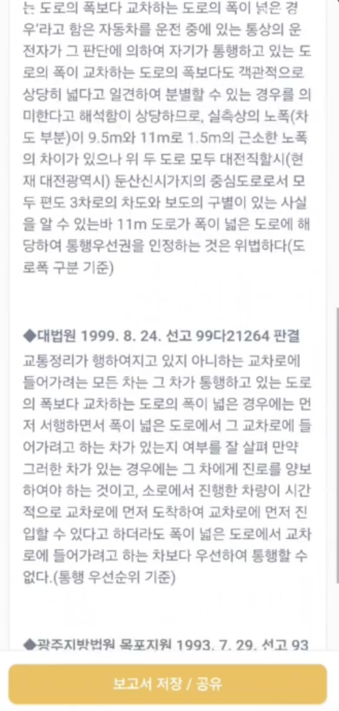
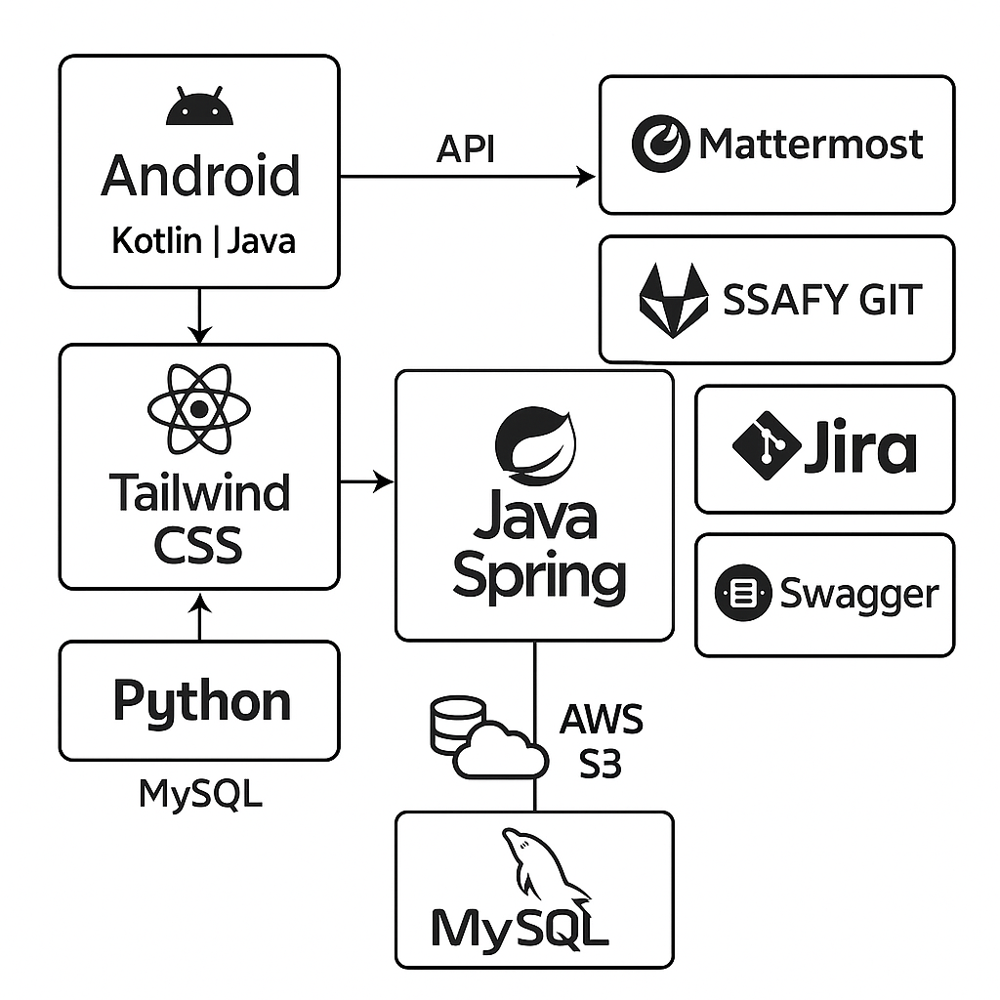

# AI블리 - AI 기반 블랙박스 영상 분석으로 과실비율을 자동 산정해주는 어플리케이션

---

## 프로젝트 소개
**AI블리(AI 블랙박스 리뷰)**는 사용자 조작 없이도 블랙박스 영상을 자동으로 인식하고 분석하여, 교통사고에 대한 과실비율, 사고 유형, 사고 차량의 손상 부위, 관련 판례 및 법률정보 등을 종합적으로 제공하는 AI 기반 사고 분석 애플리케이션입니다.

기존의 사고 처리 과정은 보험사와의 협의, 손해사정사 판단 등으로 인해 최대 2주 이상 지연되는 경우가 있으며, 이로 인해 운전자는 큰 불편과 불확실성을 겪게 됩니다.
AI블리는 이러한 과정을 자동화하고 객관화함으로써, 사고 직후 빠르게 분석 보고서를 생성하고, 전문가 수준의 정보와 해석을 사용자에게 즉시 제공합니다.

이를 통해 누구나 전문 지식 없이도, 합리적인 사고 판단과 대응이 가능하도록 돕는 것을 목표로 합니다.

### 📸 앱 사용 화면 미리보기

<table>
  <tr>
    <td align="center"><strong>홈 화면</strong></td>
    <td align="center"><strong>알림</strong></td>
    <td align="center"><strong>분석 리포트</strong></td>
    <td align="center"><strong>충돌 부위 시각화</strong></td>
    <td align="center"><strong>법률 판례 정보</strong></td>
  </tr>
  <tr>
    <td></td>
    <td></td>
    <td></td>
    <td></td>
    <td></td>
  </tr>
</table>

### 주요 기능
- **자동 영상 감지**: 사용자가 교통사고 블랙박스 영상을 저장하면, 앱을 열지 않아도 AI가 자동으로 사고 여부를 분석하고 과실비율을 산정합니다.
- **사고 유형 분류 및 과실비율 산정**: 실제 판례 데이터를 학습한 AI가 사고 유형을 분류하고 적절한 과실비율을 계산합니다.
- **실시간 알림 및 보고서 제공**: 분석이 완료되면 푸시 알림과 함께 앱 내에서 보고서를 확인할 수 있으며, PDF로 다운로드도 가능합니다.

## 프로젝트 특장점

### 기능 관점

1. **비접속 자동화 처리**: 사용자가 앱에 들어가지 않아도 AI가 백그라운드에서 자동으로 분석 진행
2. **전문가 수준 판단**: 손해사정사 판단 기준 및 판례 기반의 과실비율 제공
3. **수동업로드 기능**: 과거 사고 영상도 사용자가 직접 업로드하여 분석 요청 가능 (장소/시간 제약 없이)

### 기술 관점
1. **영상 분석 최적화**
- Optical Flow + BiLSTM 기반 차량 경로 추적
- 충돌 순간을 중심으로 영상 70~95% 구간 프레임만 집중 분석하여 효율성 향상
- 3인칭 시점 경로 시각화를 통해 사용자가 직관적으로 사고 경로를 파악 가능
2. **영상 감지 및 필터링 시스템**
- ContentObserver + MediaStore API를 활용하여 실시간 영상 감지
- DCIM 폴더 내 파일명/확장자 패턴 기반 필터링
- 5초 내 사고 여부 판별 → 사용자의 수동 작업 최소화
3. **고정밀 사고 유형 분류 시스템**
- VTN 기반 사고 유형 예측
- 본인 차와 상대 차량 궤적, 사고 위치, 신호등 여부 등 약 300만 건의 메타데이터 학습
- 실제 판례 기반으로 사고 유형 → 과실비율로 이어지는 자동화 구조
4. **과실비율 산정 알고리즘**
- 차량 위치 탐지(MOG2 & Masking), 주변 물체 제거 등 정밀 전처리
- 최종 충돌 지점의 중앙 좌표 계산을 통해 사고 발생 위치 자동 추론
- 법률/판례 데이터를 참조하여 과실비율 근거 제공
5. **자원 최적화 설계**
- ForegroundService와 스레드 풀(ThreadPool)을 활용해 백그라운드 지속 실행 가능
- 캐시 관리(최대 500개), 메모리 누수 방지, 리소스 정리 로직 적용
- 중복 탐지를 막기 위한 최소 스캔 간격(10분) 설정

## AI 기술 활용
1. **차량 위치 탐지 (Object Detection)**
- YOLOv8 + MOG2 + Masking 기반으로 영상 속 차량, 신호등 등 객체를 탐지
- 빛 번짐 및 그림자 제거 등 전처리를 통해 정확도 향상
- 탐지된 객체는 JSON 형태로 좌표 저장되어 경로 분석에 활용됨
2. **차량 경로 추적 (Trajectory Prediction)**
- Optical Flow를 활용하여 프레임 간 픽셀 움직임 기반 궤적 추출
- BiLSTM을 통해 시간 순서 기반의 경로 예측 → 누락 프레임 보완 가능
- 충돌 순간의 좌표 평균 → 사고 지점 자동 추정
- 경로는 3인칭 시점으로 시각화되어 리포트에서 사용자가 쉽게 사고 경로 파악 가능
3. **사고 유형 분류 (Accident Classification)**
- Vision Transformer Network (VTN) 기반 영상 흐름 학습
- 차량 경로, 사고 지점, 신호등 여부 등 약 300만 개 메타데이터를 조합하여 사고 유형 자동 분류
- 주요 사고 유형: 직선도로 / T자형 교차로 / 주차장 / 신호등 유무 등
4. **과실비율 산정 (Liability Ratio Estimation)**
- 사고 유형 분류 결과에 따라 판례 DB를 기반으로 과실비율 산정 로직 적용
- 영상 속 상황(신호 유무, 중앙선 등)을 반영하여 판단
- 결과 보고서에는 법적 판례 및 기준이 함께 제공되어 납득 가능한 설명 제공
5. **사고 여부 판단 AI (GPT-4 Vision)**
- 영상 업로드 시 GPT-4 Vision 모델이 사고 영상 여부(T/F) 판단
- 충돌이 명확히 인식되는 경우만 분석 프로세스로 이동하여 리소스 최적화
6. **프레임 우선순위 기반 분석 최적화**
- 사고 영상의 일반적인 패턴(초반은 주행, 후반부에 사고) 고려
- 영상의 70~95% 구간에 집중하여 프레임 추출 → 분석 속도 & 정확도 향상
- 자동 재시도 로직을 포함하여 실패한 프레임 추출도 최대 3회까지 보완

## 팀 구성 및 역할

### AI 개발
- 윤수한
- 구희원
- 전신빈

### APP - FE, BE 개발
- 최미서 (팀장)
- 전신빈
- 최수환
- 홍해지

### 인프라 구축
- 최수환

## 기술 스택

### AI
- Python
- YOLOv8
- BiLSTM
- Optical Flow
- VTN

### 프론트엔드
- NEXT.js
- Kotlin
- Tailwind CSS
- TypeScript
- FIREBASE
- JavaScript

### 백엔드
- Java 17
- Spring Boot
- Spring Security (JWT, OAuth2)
- Spring Data JPA
- RESTful API
- FCM (Firebase Cloud Messaging)

### 데이터베이스
- MySQL

### CI/CD \& 인프라
- AWS EC2
- AWS S3
- Docker
- Jenkins
- Nginx

### 개발 도구
- JupyterHub
- Anaconda
- NVIDIA CUDA Toolkit
- SSH + Terminal (Jupyter Terminal)
- nvidia-smi/htop
- Android Studio
- IntelliJ
- VSCode
- Git, GitLab
- Jira
- Mattermost
- MySQL Workbench

## CI/CD - Jenkins + Docker 기반 자동 배포

이 프로젝트는 Jenkins와 Docker를 활용한 CI/CD를 적용하여, 코드가 변경되면 자동으로 빌드 및 배포가 이루어지도록 설정되어 있습니다.

### CI/CD 파이프라인 흐름

1. GitLab Push 이벤트 발생 → GitLab 이 Jenkins를 트리거함
2. Jenkins가 프로젝트를 빌드 (Gradle/Spring Boot, React, FastAPI 등)
3. Docker 이미지 빌드
4. 서버에서 최신 Docker 이미지를 실행
5. Nginx로 리버스 프록시 역할을 수행하며, 외부 요청은 내부 Docker 서비스로 라우팅하고 내부 서비스 간 통신 중계

## 설계 문서

- 와이어프레임: https://www.figma.com/design/wJGdf2lM9Qdg1LK5ax7zxv/Untitled?node-id=0-1\&t=6lcB7t8WEBTDRzIw-1
- ERD: https://www.erdcloud.com/p/tikF6ZtWviX9RifWH
- API 문서: https://www.notion.so/RealLogi-API-1a059e7b696980da92f3cfb3a0b20ae7?pvs=4

# 아키텍쳐

⁂

