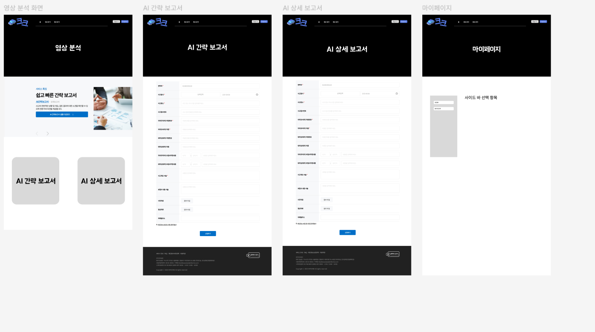

## 배경
- 최근 급증하는 생활 폐기물로 인해 분리수거의 중요성이 커지고 있음.
- 수작업 분리배출은 번거롭고 시간 소모가 크며, 환경미화원들의 건강 문제도 발생.
- 이에 따라 AI와 센서를 활용한 자동 분리수거 시스템의 필요성이 제기되고 있음.

## 개요
- 프로젝트 명 : 스마트 분리수거 시스템 (예: SmartRecycle, AI Bin 등)
- 목표 : 사용자가 쓰레기를 넣기만 하면 카메라 및 센서를 활용하여 쓰레기 종류를 자동 분류하고 해당 분리함으로 이송
- 기술 스택 예시 : 
    - 하드웨어 : 카메라, 적외선 센서, 무게센서, 서브모터
    - 소프트웨어 : 비전모델 (예: YOLO, MobileNet) , Raspberry Pi 또는 Jetson Nano
    - 분류 항목: 플라스틱 / 캔 / 종이 / 음식물 / 일반쓰레기 등

## 주요 기능
1. 실시간 쓰레기 이미지 인식
    - AI 모델을 통해 쓰레기 이미지를 분류 (사전 학습된 데이터셋 활용)

2. 자동 분류 및 배출
    - 모터 제어로 해당 쓰레기를 적절한 분리함으로 이동

3. 부피/무게 측정
    - 쓰레기의 무게나 부피 정보를 측정하여 데이터화

4. 사용자 인터페이스 (선택사항)
    - LCD 화면 또는 웹 기반 UI를 통해 사용 이력, 분류 정확도 제공

5. 통계 및 데이터 분석 (클라우드 연동)
    - 수집된 분리수거 데이터를 클라우드로 전송하여 재활용률 분석 및 정책 개선에 활용 가능

## 기대효과
- 정확한 분리배출을 통해 재활용률 증가
- 환경미화원들의 작업 부담 및 위험성 감소
- 지자체 및 건물 내 쓰레기 관리 효율성 향상
- 장기적으로는 지능형 스마트시티 환경 인프라로 확장 가능성

## 배경
- 국내 재활용 선별장에서는 수작업 분류에 의존하는 비율이 여전히 높고, 이로 인해 인력 부족 및 작업 환경의 위험성이 문제가 되고 있음.
- 플라스틱, 금속, 유리 등 다양한 재질의 쓰레기가 혼합되어 있어 정확한 분류가 어려우며, 분리 오류는 재활용 효율 저하로 직결됨.
- 이러한 문제를 해결하기 위해, 컨베이어 벨트를 흐르는 쓰레기를 자동으로 인식 및 분류하는 AI 기반 시스템의 필요성이 대두됨.

## 개요
- 프로젝트 명 : 스마트 산업용 쓰레기 자동분류 시스템 (예: SmartWasteLine, AutoRecycle AI)
- 목표 : - 쓰레기 처리장에서 컨베이어 벨트를 통해 흐르는 폐기물을
    
    → **카메라 및 센서로 실시간 분석**
    
    → **AI 모델로 재질 및 종류를 분류**
    
    → **분류 결과에 따라 기계적으로 특정 라인으로 배출 처리**
- 적용 대상 : 재활용 선별장, 지자체 폐기물 처리장, 대형 건물 쓰레기 처리 시스템

## 주요 기능
1. 컨베이어 라인 실시간 비전 인식
    - 고속 카메라 및 조명 설치
    - YOLOv8, EfficientNet 등 CNN 기반 비전 모델로 실시간 객체 및 재질 분류
    - 예: PET병, 캔, 유리병, 종이, 음식물 잔여물 등

2. 자동 분기/분리 모듈 제어
    - 공압 제어 장치나 서보 모터를 통해 쓰레기 분기
    - AI 인식 결과에 따라 분류된 통로 또는 수거함으로 이동

3. AI 학습 및 정확도 개선 기능
    - 지속적인 학습 데이터 축적 및 재학습 자동화
    - 잘못 분류된 사례는 관리자 승인 후 재학습

4. 산업용 센서 연동
    - 무게 센서, 근접 센서, IR/적외선 감지로 보조 인식
    - 금속 감지 센서를 통해 금속류 자동 탐지 가능

5. 운영 인터페이스 및 통계
    - 웹 기반 Dashboard로 실시간 분류 현황 모니터링
    - 분류 비율, 오류율, 처리량 통계 제공

## 기대효과
- 분류 정확도 향상 → 재활용률 증가 → 폐기물 처리 비용 절감
- 인력 의존도 감소 → 작업자 위험 최소화 및 효율화
- 지속 가능한 AI 분리 시스템 구현 → 환경 규제 대응력 강화
- 데이터 기반 폐기물 처리 전략 수립 가능
- 장기적으로는 전국 단위 선별 시스템의 자동화 도입 기반 마련

### 최종 주제

# 블랙박스 영상 기반 교통사고 과실 판단 시스템

## 프로젝트 개요

차량 블랙박스 영상을 업로드하면 AI 기술을 활용하여 교통사고 상황을 분석하고 과실 비율을 자동으로 측정해주는 웹 서비스입니다. 객체 인식 기술로 도로 상황을 파악하고, 법률 정보를 기반으로 과실 비율을 산정합니다.

## 주요 서비스 기능

- **블랙박스 영상 분석**: 사용자가 업로드한 영상을 AI 기술로 분석하여 과실 비율 자동 산정
- **커뮤니티 게시판**: 분석된 블랙박스 영상을 공유하고 다른 사용자들과 의견 교환 가능
- **사고 유형 태깅**: 영상에 ‘추돌사고’, ‘측면충돌’, ‘신호위반’ 등 태그를 부여하여 분류
- **실시간 알림**: 분석 완료 시 SSE(Server-Sent Events) 기술을 활용한 실시간 알림 제공
- **이메일 알림**: 장시간 소요되는 분석의 경우 이메일로 완료 알림 발송
- **과실 근거 제시**: LLM과 RAG 기술로 대한민국 교통사고 처리 기준에 따른 과실 산정 근거 제공
- **유사 사례 조회**: 태그 기반으로 유사한 사고 사례와 과실 판단 결과 비교 가능
- **법률 정보 제공**: 사고 유형별 관련 법규 및 판례 정보 제공
 
## 기획 구체화

## 요구사항 명세서 4/16

## 피그마 (진행중) 4/17

## 피그마 (진행중) 4/18

## 피그마 (진행중) + 개인공부 4/19

## 프로그램 명세서 & JIRA 백로그 작성 4/21

## 설계 미팅 & 팀 회의 & 피그마 재구성

## 프로젝트 결정사항

- 프론트 -> 코틀린+안드로이드 스튜디오(백그라운드 기능) + Next.js + Capacitor (웹앱 UI)
- 블랙박스 쪽 공문서 작성